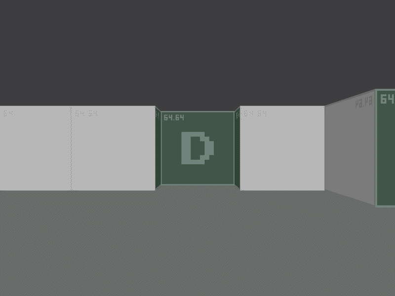

# Raycaster
A game engine using the [raycasting](https://en.wikipedia.org/wiki/Ray_casting) method. The engine has been inspired by a game you probably already know, [Wolfenstein 3D](https://en.wikipedia.org/wiki/Wolfenstein_3D).

> [!Note]
> This is an old and unfinished project. The engine is missing major features (enemy AI, weapons, menu, etc.) that will be implemented in the future... or not.



## Assets
The engine uses a custom-made archive (`.arc`) file format for asset handling. The format is almost a one-to-one copy to the simple [WAD](https://doomwiki.org/wiki/WAD) file format created by id Software for their early titles with few exceptions in how the data is formatted and laid out.

The detailed structure of the `.arc` file format is described in the [arc.h](src/archive/arc.h) file.

## Dependencies
- [GCC](https://gcc.gnu.org/) - **C compiler**
- [SDL3](https://www.libsdl.org/) - **windown and input handling**

## Building
> [!Note]
> Building the binary is only possible once all of the dependencies listed above are installed on your system.

Run the `Makefile` using
```
$ make build
```
to build the binary. The resulting binary will be located in the `out` directory. To run the binary, simply:
```
$ make run
```

## References
- [WAD File Structure](https://doomwiki.org/wiki/WAD)
- [Lode's Tutorial on Raycasting](https://lodev.org/cgtutor/raycasting.html)
- [Game Engine Black Book: Wolfenstein 3D](https://fabiensanglard.net/gebbwolf3d/)
